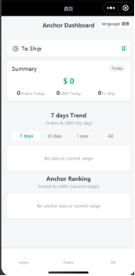
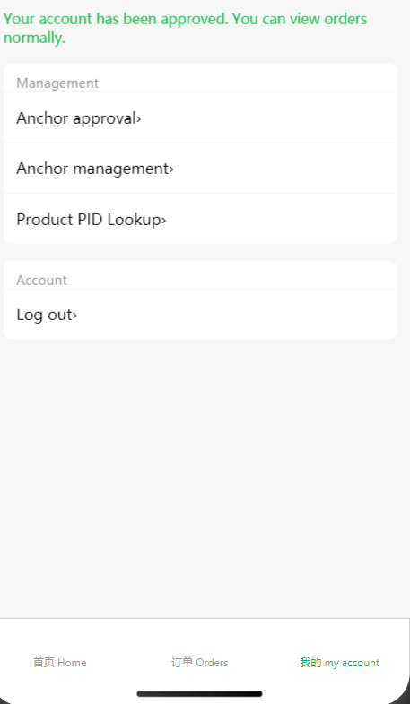
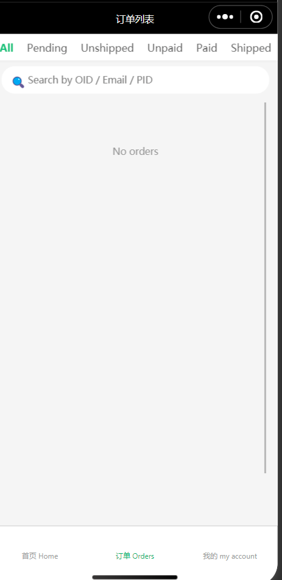
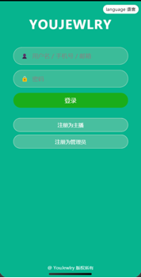

# YOUJEWLRY Anchor Order Management Mini Program

A WeChat Mini Program built on Cloud Development, designed for anchors and admins to manage orders, approvals, and synchronization. Frontend lives in `miniprogram/`, cloud functions live in `cloudfunctions/`.

## Highlights
- End-to-end flow: register/login -> approval -> order sync -> order viewing and management
- Role-based access: admin and anchor permissions are separated
- Modular backend: order sync, PID binding, and monitoring are split into cloud functions
- i18n: bilingual copy and dynamic TabBar labels

## Features
- Login/registration (admin, anchor)
- Dashboard: today order count, GMV, to-ship
- Order list/detail: search, pagination, access control
- Anchor management: approval, anchor list, PID binding, historical order backfill
- Order sync and monitoring (cloud functions)
- Runtime caching for dashboard and orders

## Screenshots
> Put the screenshots in `docs/images/` with the names below.

- Home dashboard: `docs/images/01-home.png`
- Account/admin entry: `docs/images/02-mine.png.png`
- Order list: `docs/images/03-orders.png.png`
- Login: `docs/images/04-login.png`

<table>
  <tr>
    <td></td>
    <td></td>
  </tr>
  <tr>
    <td></td>
    <td></td>
  </tr>
</table>

## Tech Stack
- WeChat Mini Program (native)
- WeChat Cloud Development (cloud functions + database)
- Node.js runtime for cloud functions

## Project Structure
- `miniprogram/` frontend
- `cloudfunctions/` cloud functions
  - `backendFunction/` aggregated business APIs (orders, users, approvals)
  - `orderSync/` order synchronization
  - `monitorSync/` sync monitoring
  - `pidFunction/` PID-related APIs
  - `productAdmin/` product admin utilities

## Quick Start
1. Import the project in WeChat DevTools (root `project.config.json`)
2. Create a cloud environment and set it in `miniprogram/app.js` (`globalData.env`)
3. Deploy cloud functions from `cloudfunctions/` (install deps if required)
4. Build and run the Mini Program

## External API Config (Required)
`orderSync` and `pidFunction` integrate with external APIs and default to mock.
Create local config files (not committed to Git):
- `cloudfunctions/orderSync/utils/config.local.js`
- `cloudfunctions/pidFunction/utils/config.local.js`

Example:

```js
module.exports = {
  IS_MOCK: true,
  ACCESS_NUMBER: 'YOUR_NUMBER',
  SECRET: 'YOUR_SECRET',
  BASE_URL_MOCK: 'https://youjewelry.free.beeceptor.com/gateway/',
  BASE_URL_PROD: 'https://www.yousjewelry.com/gateway/',
  API_FROM: 'your_source',
};
```

Notes:
- `IS_MOCK` uses the mock endpoint when true
- `ACCESS_NUMBER` and `SECRET` are API credentials
- `API_FROM` is only used by `pidFunction`

## Roles and Access
- Anchor: can only view orders bound to their account
- Admin: can access approvals, anchor list, PID binding, and backfill tools

## Key Pages
- Home: order count, GMV, to-ship summary
- Orders: search and status filters
- Order detail: order basics, shipping, notes
- Admin: anchor approval, PID binding, historical backfill

## Reference
- WeChat Cloud Development docs: https://developers.weixin.qq.com/miniprogram/dev/wxcloud/basis/getting-started.html
